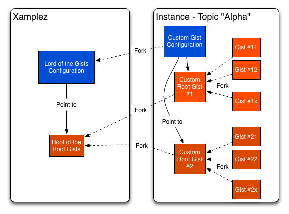

# Welcome to Xamplez.io

> Help us build an OpenSource Knowledge Cluster of Code Snippets

## Xamplez.io's idea?

Xamplez is based on a very simple idea: 
> I want to share code snippets (and nothing else) about a given topic with a simple description 
> & be able to search them based on tags, ratings etc...

Our primary goal is to **help people build their own stores of code snippets focusing on specific topics**.
The topic can go from very generic subjects such as programming language or frameworks to more specific ones such as 
very precise technical points or even funnier subjects. It's up to you to do what you want...

> We were inspired by [140byt.es](http://www.140byt.es/) idea based on GIST but we wanted to go further in a more generic manner.

We aim at creating multiple instances of Xamplez. 

We think one Xamplez's instance should focused on one topic as much as possible. 
But multi-topic instances can be considered naturally.

One **Xamplez's instance is just a server but it doesn't store any code snippets**: they are stored in Gists.
The server is just there to discover and index the gists about your topic and provide a **Search Engine**.
You can kill the server and re-launch it somewhere else and it will just be down meanwhile it re-builds the index.

Finally, to become a real Xamplez instance, **we propose to adopt a very few common rules**. As soon as you follow these rules 
and create a server instance, you are implicitly participating to the Xamplez's constellation.

 
## Xamplez.io's Rules

### Literary version
> One Gist to rule them all, One Gist to find them,
>
> One Gist to bring them all and in the <ChooseYourWord>ness bind them

### Common version

> - One Xamplez's instance requires to fork the **Lord of the Gists** that rules all the configurations of all instances!</li>
> 
> - The Configuration Gist must point to one (or more) Root Gist(s)</li>
> 
> - All code snippets concerning one topic(s) must fork the same Root Gist(s).</li>
> 
> - One Xamplez's instance can point to one or more Root Gist(s).</li>

As you can imagine, using the great power of Github API, from your Root Gist(s), you can then find all code snippets 
about your topic.

 
## What's Xamplez.io out-of-the-box ?

Taking this rule into account, we have built current github project to help you kickstart your own instance of
Xamplez.io for your own topic(s). 

First of all, we made [Xamplez.io](http://www.xamplez.io) completely opensource, nothing hidden. We want people to contribute to it, 
to improve it & to fork it for their own needs and things we haven't imagined yet. 

We'd just like to keep a link between all forks/instances (following the forks of _Lord of the Gists_) because
we aim at building an opensource knownledge cluster based on Gist and improve the concept progressively.

So, for now, Xamplez.io provides out-of-the-box:

### The mandatory [Lord of the Gists](https://gist.github.com/xamplez-admin/5897409) 

It's the father of all Configuration gists to be able to re-find all existing instances of Xamplez.

>When you create a new instance of Xamplez, you should just fork this gist.

It's used to store all custom configurations for Xamplez instance and specially the link to the Root Gist(s) of your instance. 

In this configuration, you can store one or more files:

 * custom Play configuration (if you use our default server implementation)
 * custom CSS
 * custom HTML templates
 * local messages
 * etc...

### The [Root of the Root Gists](https://gist.github.com/xamplez-admin/5993903) = code snippet template

> Just remember one thing: 

> One topic = One group of Gists forking the same Root Gist

One instance of Xamplez can have several root gists.

This Root of the Root Gists isn't mandatory but it provides a default template and we encourage forking it 
when you start a new topic.

This Gist is based on 4 files:

 * `code` that can be renamed with your extension: for ex, `code.scala`
 * `README.md` containing xamplez guide explaining how to write code snippets
 * `_License.txt` containing a potential license for your code
 * `meta` containing metadata used by xamplez.io backend
 
### A **default Opensource server implementation** 

This is an autonomous server capable of building a code snippet search engine starting only with the ID of your Root Gist. 
It's based on:
 
 * Play2.1/Scala + ElasticSearch for backend
 * AngularJS for frontend

Please note that we don't impose anything about the backend and you can implement it as you want. But naturally, 
our default implementation provides the default mechanisms and our vision. So, we'd like people to
improve this default implementation and contribute to the github project so that everyone can take advantage of 
the same well built backend and build an instance very quickly.

> We will progressively document our backend implementation and specially the use of the configuration Gist which
is quite cool to customize your instance very easily.

### A domain `xamplez.io`

We would like to gather all Xamplez instances under this domain `xyz.xamplez.io`. It's not mandatory but we think it would be cool ;)
 
> Xamplez Core Server is licensed under classic Apache2 which provides the freedom we expect and will maintain the link between core projet and its forks.

 
## How to create a new instance of Xamplez.io

 1. Fork this github project if you want to use our default implementation
 2. Fork the **Lord of the Gists Configuration** to create your Configuration Gist
 3. Fork the **Master Conf Gist** to create your Conf Gist & put Root Gist ID in it (potentially several times)
 4. Put Conf Gist ID in `conf/application.conf` in the parameter `gist.roots=[ GIST_ID, ...]`
 5. Fork Root Gist to create a few snippets :

  * You MUST put a gist description which summarizes your snippet as precisely as possible.
  * All words starting in the description with a dash #tag are indexed as tags.
  * You can add as many files as you want in your gist
  * File extensions are used to identify the language (e.g. code.scala -> scala)
  * A code snippet shouldn't be too big (a few lines if possible) so don't hesitate to cut in several files
  * If you want to explain precisely your code or provide usage examples, please use a Markdown file (e.g. README.md)
  * You can put a License in case your code need to be protected in anyway

> If you accept to link your instance to original xamplez.io, contact us at contact@xamplez.io so that we create a subdomain for your instance in xamplez.io
   
>     Topic foobar => sub-domain foobar.xamplez.io

 
## The team behind Xamplez.io

If you want to contact us : contact@xamplez.io

(in alphabetic order)

* Jacques Bachellerie, backend ninja
* Paul Dijou, frontend/AngularJs kung(fu-)guru 
* Gaetan Renaudeau, initiator & frontend ma(d)ster
* Pascal Voitot, initiator & backend terrible bogeyman

